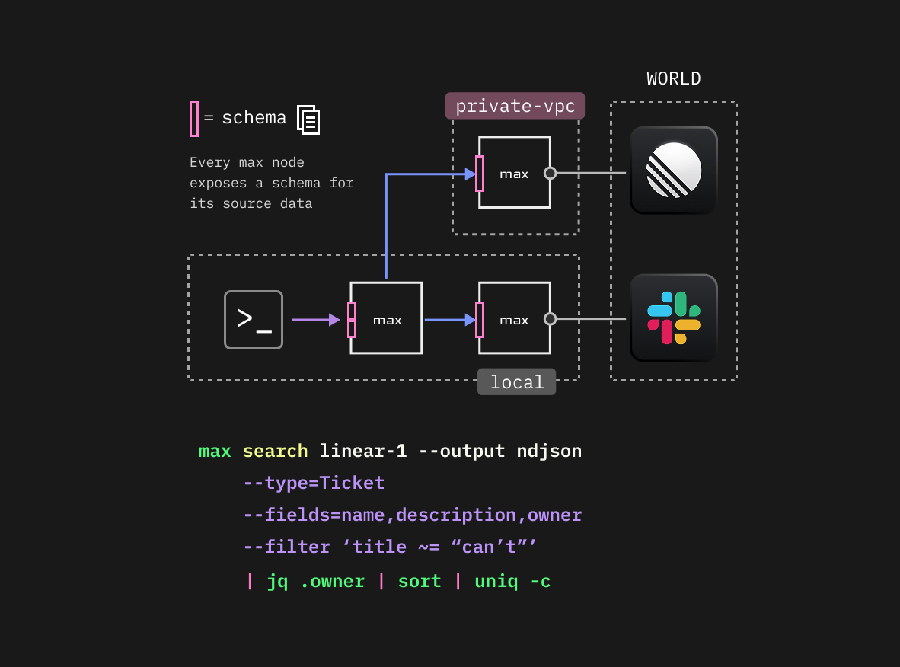

```
 _____ _____ __ __
|     |  _  |  |  | 
| | | |     |-   -|
|_|_|_|__|__|__|__| 
```

## What is max?

Max is a federated data query layer that **schematizes** and **reflects** source data right to where it's needed:



> Max turns any data source into a fast, "agent-local", queryable data provider

It's designed so that agents have fast and unfettered access to data - without needing to hit APIs or go through slow/limited MCP connectors.  

Typical use cases include tooling like Linear, Hubspot, Jira, Google Drive etc; but any source can have a max node created for it.  

### Why use Max when MCP already exists?

MCP is inherently restrictive, both from a throughput and a data-access perspective.  
- **On throughput** - you are typically rate-limited.  
- **On access** - you will only see what the API / MCP service gives you an endpoint for, even though the data itself may be technically available. For example, your favourite ticket-management tool may not give you a way to search _inside_ titles... 

By pulling data **out** of a source and **schematising** it, you automatically get some benefits:
- **what you can search for** is unrestricted (the schema bares all)
- **how fast you can search** is unrestricted - your max node dictates its own throughput
- **search has a common language** across all data sources
- throughput cost (for the most part) paid only once

```bash
max connect @max/connector-linear --name linear-1

max sync linear-1
>> 68,012 records syncd

max search linear-1 --filter 'title ~= "AcmeCo"' --fields=status,title
>> ... 1,138 records (1.8ms)
```

In practice, this means that when your agent asks to find all customers with double-barrelled surnames, it takes milliseconds rather than hours:
> `max search hubspot-1 --filter 'lastname ~= " "' --all | wc -l`

### Why is max (or any CLI) so much more performant than MCP?

This is well documented. In general, you can expect orders of magnitude more time and token efficiency when using a CLI over an MCP connector,
because a CLI positions an agent well to operate on data _before_ that data hits its context window.  

This of course varies case-by-case, but to provide a motivating example from a real-world test-case:

> *"What are the top 10 first names in HubSpot, and how many Google Drive files mention them in the title?"*

|         | Tokens | Time  | Cost    | Performance X |
|---------|--------|-------|---------|---------------|
| **MCP** | 180M+  | 80m+  | $180+   | -             |
| **Max** | 238    | 27s   | $0.003  | **~60,000x**  |

Note: MCP figures are extrapolated - we had to terminate claude mid-run due to repeated recompactions and a not-unlimited buget. Additionally, the $180 cost doesn't include any calls to google drive (the second half of the challenge).

In the scenario above, Claude (alone) tried to paginate over 100,000 records from Hubspot, 200 users at a time.  
With a `max` connector, the same Claude simply issued the query it needed.

Having a CLI allows your agent to `cut`, `grep`, `sed`, `sort` pipe to `jq` etc. and redirect at will.

## Max has a CLI
Max is designed as a set of protocols and libraries, with a platform-agnostic implementation layer.  
There is one runtime offered so far (`platform-bun`) - but others will follow.

All functionality in max's core is exposed through the `@max/cli`.

**CLI example**:
```bash
max -g ls
max -t my-workspace ls
# OR
cd /path/to/my-workspace && max ls
```

**Or via code:**

```typescript
const max = BunPlatform.createGlobalMax()
max.listWorkspaces()
max.workspace("my-workspace").listInstallations()
```


# Status

> **⚠️ Alpha.** Max is under heavy active development!  
> 
> Expect breaking changes, rough edges, and missing features. We're releasing early because the core idea works and we want feedback.

# Immediate roadmap:
The current high priority items are: (timestamped: `2026-02-27`)

**Real-time sync**:

- Make `sync --continue` for incremental operations
- Expose a service interface so installations can listen to events for webhook input:  `max -t <installation> service start --all`
- **Dependencies:** design installation "services"


**Just-in-time (JIT) entity loading**

- `engine.load(JiraTicket.ref("JT-1883")` to support direct loading from the upstream. See [](docs/ideas/field-freshness-and-incremental-sync.md)
- this unlocks the ability to _avoid_ an upfront sync at all
- design caching primitives
- **Dependencies**: None.

**Plugin architecture**

- Create plugin framework: `[Ingest]` -> `[Index]` -> `[Store]` -> `[Query]` -> `[Deliver]`
- Initial plugins: permissioning at `[Ingest]` and `[Deliver]`
- Future: `[Indexing]` plugins (e.g. vector store, knowledge graph etc)  

**Permission and identity**

- Schematise permissions of upstream tooling
- Mirror the same access controls to `search` layer
- **Dependencies**: Plugin architecture

A broader, lightweight roadmap can be found here: [ROADMAP.md](ROADMAP.md)

 
# Max architecture overview

All implementations target nodejs / javascript / bun. All platform-specifics are pushed into modules.

**Core components**

| package         | purpose                                              | platform agnostic                |
|-----------------|------------------------------------------------------|----------------------------------|
| `@max/core`      | types and utilities                                  | ✅                                |
| `@max/federation` | core logic for federation                            | ✅                                |
| `@max/cli`       | max's cli. Currently (thinly) dependent on platform. | ❌ currently needs `platform-bun` |
| `@max/connector`  | core types/logic for connectors                      | ✅                                |
| `@max/execution`  | core types/logic for execution / task orchestration  | ✅                                |

**Platform bindings**
- `@max/platform-bun`

**Modules/Implementations**

| package               | purpose                                                | platform         |
|-----------------------|--------------------------------------------------------|------------------|
| `@max/execution-local`  | provides ephemeral in-memory execution / orchestration | ◯ none           |
| `@max/execution-sqlite` | sqlite-based execution implementation                  | 🟣`platform-bun` |
| `@max/storage-sqlite`   | sqlite-backed storage implemenatation                  | 🟣`platform-bun` |

 
## Library usage
Max can be imported and used as a library:

```typescript
import { BunPlatform } from '@max/platform-bun'
import { GlobalMax } from '@max/federation'

// Load a fully-functional persistent max
const max = BunPlatform.createGlobalMax({
  global:{
    root:() => '~/.max'
  }
})
max.listWorkspaces()

// Or spin up a zero-dependency implementation 
const maxLite = GlobalMax.ephemeral({
  // ...optionally inject dependencies
})
maxLite.createWorkspace({ ... })
```

The best place currently to get started with library usage is by:
- looking at the `examples` folder
- looking at any smoke tests

It's also highly worth reading the [max developer guide](docs/developer/README.md) which goes into more detail about library usage of connectors and their schema data.  

## Quick start

### Prerequisites

- [Bun](https://bun.sh) >= 1.3.9
- [Rust](https://rustup.rs) (for native dependencies)

### Install

```bash
git clone https://github.com/maxdata-sh/max.git
cd max
bun install

# Put max on your path somewhere
PATH=$PATH:`pwd` 
```

### Shell completions

Max can generate shell completions for you:

```bash
# Zsh
max completion zsh > ~/.max-completions.zsh
echo 'source ~/.max-completions.zsh' >> ~/.zshrc

# Or, if you use a completions directory (e.g. oh-my-zsh):
max completion zsh > ~/.oh-my-zsh/completions/_max

# Bash
max completion bash > ~/.max-completions.bash
echo 'source ~/.max-completions.bash' >> ~/.bashrc

# Fish
max completion fish > ~/.config/fish/completions/max.fish
```

## Getting started


```bash

# (optional) spin up acme in apps/acme - a fake saas tool:
cd /path/to/max/acme
./acme start --tenant default

# create a workspace
mkdir my-workspace && cd my-workspace
max init .

# connect to a connector
max connect @max/connector-acme --name acme-1 
# Max will walk you through authentication - you'll need an API token from the service you're connecting to.

# check your workspace's status
max status

# check the schema of your connector
max schema acme-1

# synchronise the installation
max sync acme-1
  Syncing...
    AcmeWorkspace  ██▓··      12  1021.8 op/s
    AcmeUser       █████     283  4391.1 op/s
    AcmeTask       ███▒·    2156  4811.3 op/s
    ──────────────────────────────────────────────
    3.2s elapsed

# query your data
max search acme-1 AcmeTask \
  --filter 'title ~= "protocol"' \
  --fields title,description \
  --output ndjson
```

The query runs locally against your synced data - fast, cheap, and doesn't touch the upstream API.   
**Roadmap item:** JIT access to upstream data, using local version as hot cache.

### Teach your agent

> ⚠️ Momentarily unavailable. The AGENT.USER.md targets an early prototype and needs updating

```bash
max llm-bootstrap
```

This outputs a context block that teaches your AI agent what Max is and how to use it, and can be written to a SKILL.md.


Your agent now knows how to discover connectors, run queries, and work with Max's output formats.

## Connectors

**@max/connector-\* Connectors coming shortly**.  Today, only the acme connector is offered.

| Connector | Status | Description |
|-----------|--------|-------------|
| **ACME** | Demo | Fictional connector for testing and learning |

### Creating a connector
See [max developer guide](docs/developer/README.md)


## Contributing

Max is early in its journey and under very active development. We're not accepting code contributions just yet whilst we allow the api to stabilize, but we'd love your feedback:

- [Open an issue](https://github.com/maxdata-sh/max/issues) for bugs, feature requests, or connector ideas
- Star the repo if you find it useful - it helps others discover Max!

## License

[Apache 2.0](./LICENSE)

---

Max is a trademark of Metomic Ltd.
