# Synchronisation Layer

How Max syncs data from external sources into its local store.

---

## Overview

The sync layer has three parts:

1. **Resolvers & Loaders** define *how* to fetch data for each entity type
2. **Seeders & SyncPlans** define *what* to sync and in what order
3. **The Executor** turns a plan into a task graph and drains it

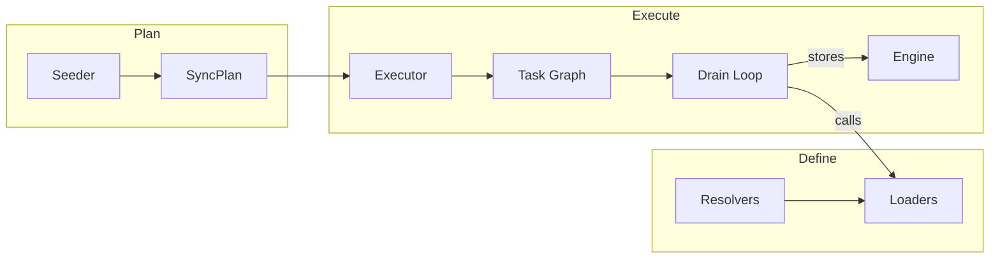

---

## Loaders

A **Loader** fetches data from an external API and returns `EntityInput` values. There are three variants:

| Variant | Signature | Use case |
|---|---|---|
| `entity` | `(ref) => EntityInput` | Fetch one entity at a time |
| `entityBatched` | `(refs[]) => Batch<EntityInput>` | Fetch many entities in one API call |
| `collection` | `(parentRef, page) => Page<EntityInput>` | Paginated child entities |

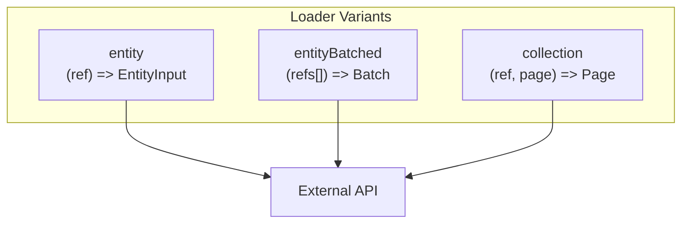

### Entity Loader

Fetches fields for a single entity.

```typescript
const TeamBasicLoader = Loader.entity({
  name: "acme:team:basic" as LoaderName,
  context: AcmeAppContext,
  entity: AcmeTeam,

  async load(ref, ctx, deps) {
    const team = await ctx.api.teams.get(ref.id);
    return EntityInput.create(ref, {
      name: team.name,
      description: team.description,
      owner: AcmeUser.ref(team.ownerId),
    });
  },
});
```

### Batched Entity Loader

Fetches fields for many entities in a single API call. Preferred when the API supports batch retrieval.

```typescript
const BasicUserLoader = Loader.entityBatched({
  name: "acme:user:basic" as LoaderName,
  context: AcmeAppContext,
  entity: AcmeUser,

  async load(refs, ctx, deps) {
    const users = await ctx.api.users.getBatch(refs.map(r => r.id));
    return Batch.buildFrom(
      users.map(u => EntityInput.create(AcmeUser.ref(u.id), {
        name: u.name,
        email: u.email,
      }))
    ).withKey(input => input.ref);
  },
});
```

### Collection Loader

Fetches a paginated list of child entities belonging to a parent.

```typescript
const TeamMembersLoader = Loader.collection({
  name: "acme:team:members" as LoaderName,
  context: AcmeAppContext,
  entity: AcmeTeam,
  target: AcmeUser,

  async load(ref, page, ctx, deps) {
    const result = await ctx.api.teams.listMembers(ref.id, {
      cursor: page.cursor,
      limit: page.limit,
    });
    const items = result.members.map(m =>
      EntityInput.create(AcmeUser.ref(m.userId), {})
    );
    return Page.from(items, result.hasMore, result.nextCursor);
  },
});
```

---

## Resolvers

A **Resolver** maps an entity's fields to the loaders that populate them. Each field points to exactly one loader.

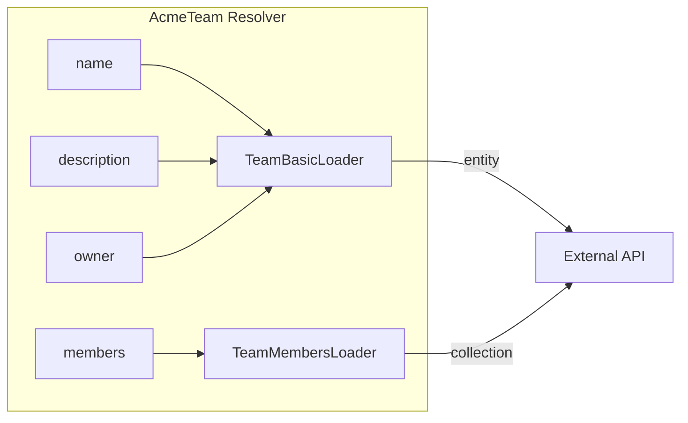

```typescript
const AcmeTeamResolver = Resolver.for(AcmeTeam, {
  name: TeamBasicLoader.field("name"),
  description: TeamBasicLoader.field("description"),
  owner: TeamBasicLoader.field("owner"),
  members: TeamMembersLoader.field(),
});
```

Multiple fields can share a loader. When the executor needs to load `name` and `description`, it sees both map to `TeamBasicLoader` and makes a single call.

---

## Seeder & SyncPlan

A **Seeder** bootstraps a sync from cold start. It stores an initial entity (the root) and returns a **SyncPlan** describing what to sync and in what order.

```typescript
const AcmeSeeder = Seeder.create({
  context: AcmeAppContext,

  async seed(ctx, engine) {
    // Store the root entry point
    const rootRef = AcmeRoot.ref("root");
    await engine.store(EntityInput.create(rootRef, {}));

    return SyncPlan.create([
      Step.forRoot(rootRef).loadCollection("teams"),
      Step.forAll(AcmeTeam).loadFields("name", "description", "owner"),
      Step.forAll(AcmeTeam).loadCollection("members"),
      Step.forAll(AcmeUser).loadFields("name", "email"),
    ]);
  },
});
```

### Steps

A SyncPlan is a sequence of steps. Each step has a **target** (which entities) and an **operation** (what to load).

**Targets:**

| Target | Meaning |
|---|---|
| `forRoot(ref)` | A single known root entity |
| `forOne(ref)` | A single known entity |
| `forAll(EntityDef)` | All entities of this type in the store |

**Operations:**

| Operation | Meaning |
|---|---|
| `loadFields("a", "b")` | Load the named fields via their resolvers |
| `loadCollection("field")` | Load a collection field (paginated) |

Steps run **sequentially** by default. Each step waits for the previous step (and all its children) to finish before starting. This matters because later steps often depend on entities discovered by earlier ones.

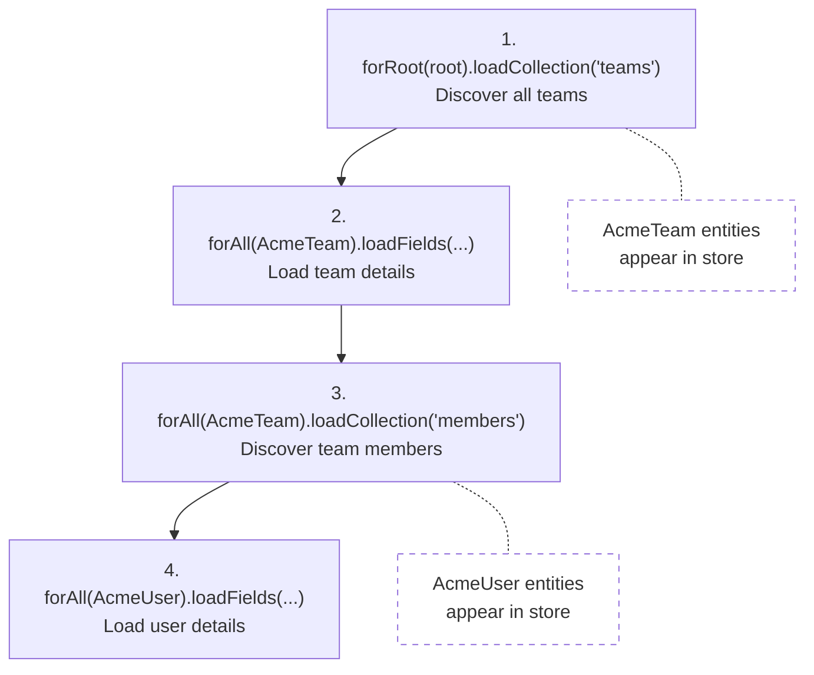

### Concurrent Steps

Steps that don't depend on each other can run in parallel:

```typescript
SyncPlan.create([
  Step.forRoot(rootRef).loadCollection("teams"),
  Step.concurrent([
    Step.forAll(AcmeTeam).loadFields("name"),
    Step.forAll(AcmeProject).loadFields("status"),
  ]),
]);
```

---

## Execution

The **SyncExecutor** turns a SyncPlan into a task graph and processes it.

### From Plan to Task Graph

The **PlanExpander** converts each step into one or more tasks, wiring up dependencies:

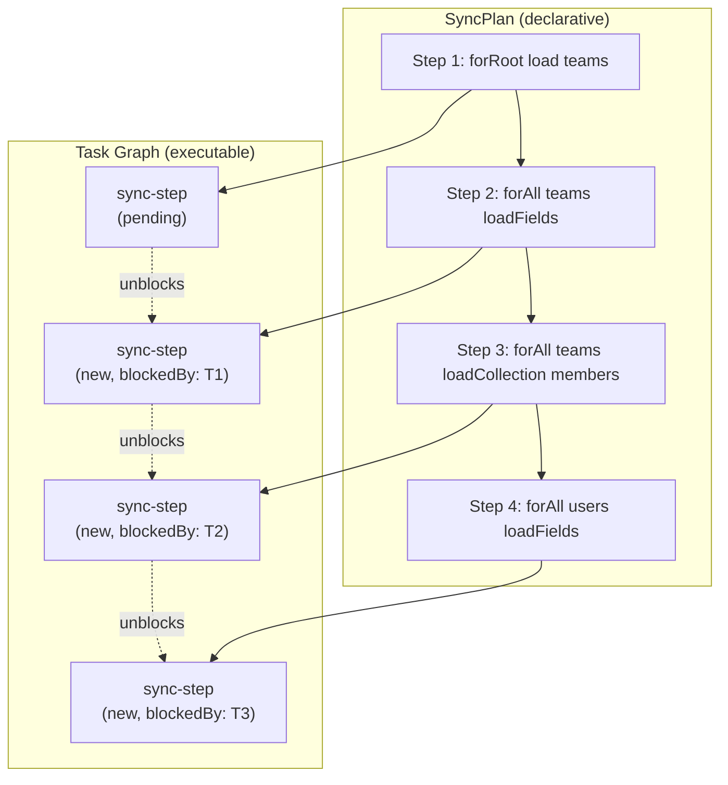

Tasks start in `new` (blocked) or `pending` (ready). When a blocking task completes, its dependents move from `new` to `pending`.

### Task States

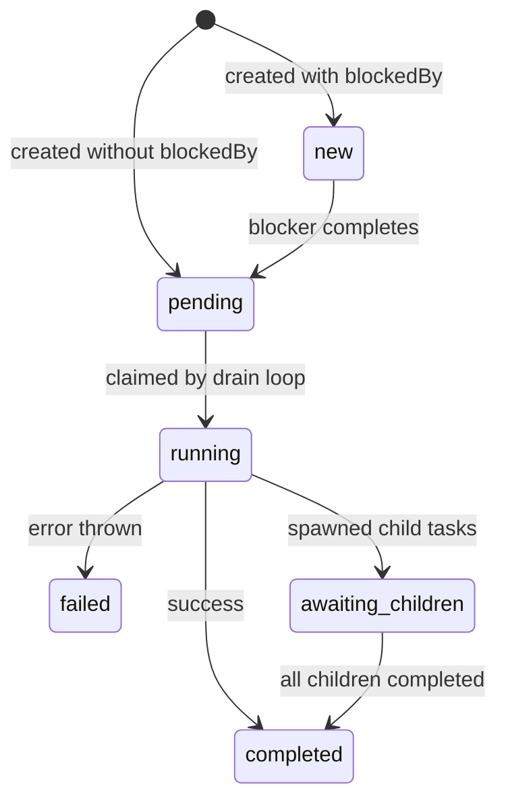

### Dynamic Children

Some tasks spawn child tasks at runtime. When a `forAll` step processes a collection, it creates one `load-collection` child per entity. The parent moves to `awaiting_children` and completes when all children finish.

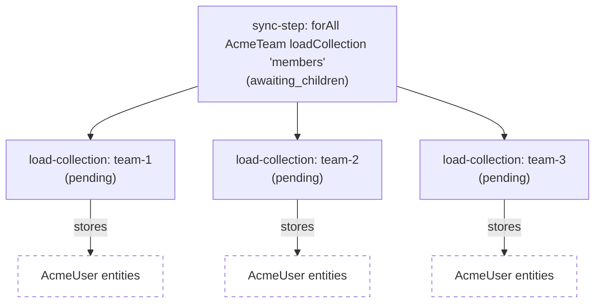

Collection loaders also paginate. If a page has more results, the task spawns a continuation child with the next cursor:

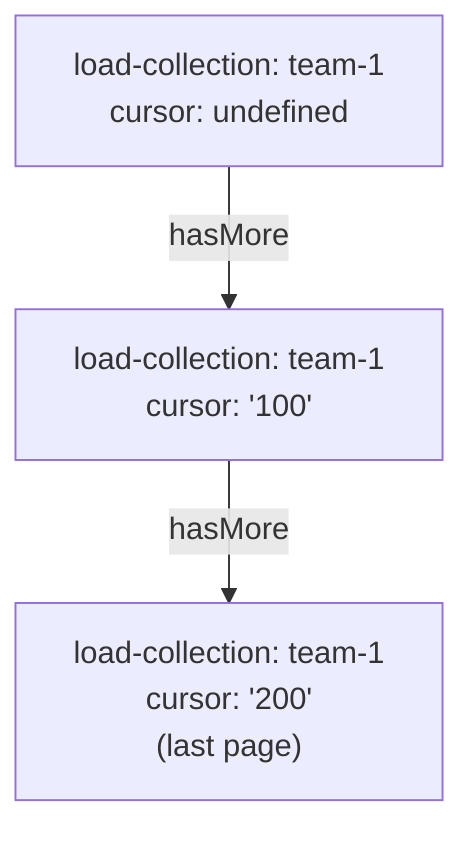

### The Drain Loop

The executor runs a single loop that claims and processes tasks one at a time:

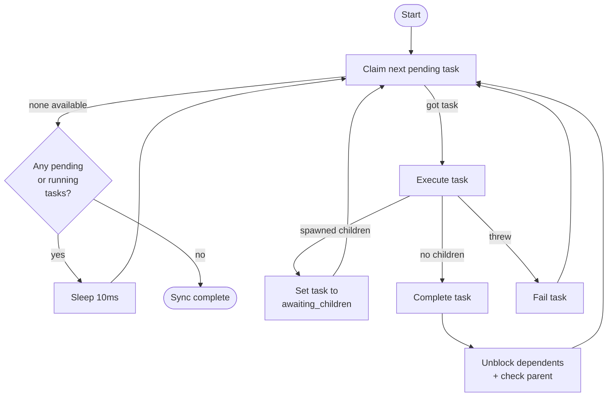

When a task completes:
1. Tasks blocked by it (`blockedBy`) move from `new` to `pending`
2. If all siblings of a parent are complete, the parent completes too (recursively)

### Error Handling

When a task fails, the drain loop marks it as `failed` and moves on. The loop exits when no tasks are `pending` or `running` — tasks left in `new` (blocked by a failed task) or `awaiting_children` (with a failed child) remain in those states.

The `SyncResult` reports both `tasksCompleted` and `tasksFailed`, so the caller knows the sync wasn't clean.

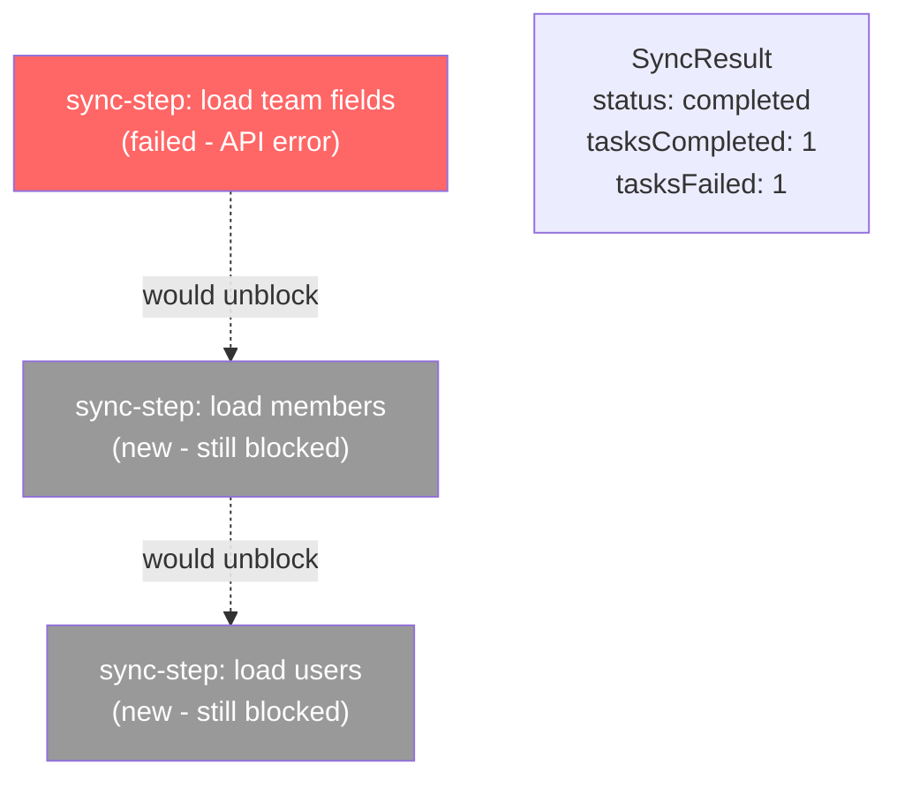

The stranded tasks preserve honest state: they weren't cancelled or failed — they were never attempted. A future resume operation could retry the failed task, which would naturally unblock the rest.

### SyncHandle

`execute()` returns a `SyncHandle` immediately. The sync runs in the background.

```typescript
const handle = executor.execute(plan);

// Monitor
const status = await handle.status();  // "running" | "paused" | "completed" | ...

// Control
await handle.pause();
await handle.resume();
await handle.cancel();

// Wait for result
const result = await handle.completion();
// { status: "completed", tasksCompleted: 12, tasksFailed: 0, duration: 1540 }
```

---

## End-to-End Example

Putting it all together for the Acme connector:

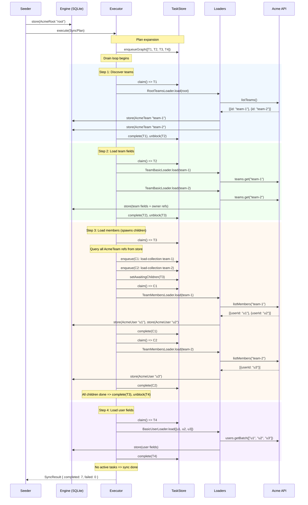

---

## Limitations & Future Work

### Not yet implemented

- **Loader dependencies (`dependsOn`)** — Loaders can declare dependencies on other loaders in the type system, but the execution layer ignores this. `DefaultTaskRunner` throws if a loader has dependencies. This blocks any loader that needs shared data from another loader.

- **Raw loaders** — `Loader.raw()` exists in the type system but the execution layer can't run it. There's no task payload type and no dispatch path. Raw loaders are intended for standalone data fetches (API config, rate limits) and are the primary use case for `dependsOn`. These two items are coupled.

- **Error recovery / resume** — When a sync has failures, stranded tasks remain in honest states. A resume mechanism could retry failed tasks and naturally unblock the rest. The state model supports this; the trigger mechanism doesn't exist yet.

### Current inefficiencies

- **Loaders run inline, not as tasks** — A `sync-step` task resolves its loaders and calls them directly. This means there's no opportunity for the system to deduplicate or batch across steps. If step 3 discovers users u1, u2, u3 and step 4 also needs u1, u2, u3, they're loaded independently.

  If loader calls were scheduled as tasks, two things become possible:
  1. **Deduplication** — multiple tasks wanting the same entity could coalesce into one load
  2. **Cross-step batching** — a batched loader could collect refs from many sources into a single API call

- **Single-threaded drain loop** — The executor claims one task at a time. For I/O-bound loaders, concurrent task execution would improve throughput significantly. The `FlowController` already exists for rate limiting and would pair naturally with concurrency.

See [ROADMAP.md](/ROADMAP.md) for the full list of planned work.

---

## Key Concepts Summary

| Concept | Role |
|---|---|
| **EntityDef** | Schema for an entity type (fields + types) |
| **Ref** | Typed pointer to an entity instance |
| **Loader** | Fetches data from an external API |
| **Resolver** | Maps entity fields to loaders |
| **Seeder** | Bootstraps a sync from cold start |
| **SyncPlan** | Ordered list of steps to execute |
| **Step** | Target (which entities) + operation (what to load) |
| **Task** | Serialisable unit of work in the execution layer |
| **SyncExecutor** | Orchestrates the drain loop |
| **TaskRunner** | Executes a single task (calls loaders, stores results) |
| **TaskStore** | Persists task state (supports restart/resume) |
| **SyncHandle** | Control and monitor a running sync |
